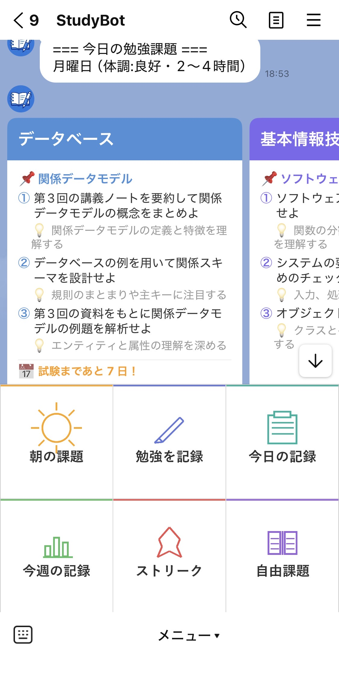

# StudyBot

LINE × Notion × 生成AI（Groq API）で作った、自分専用の勉強習慣化Botです。
毎朝・毎晩LINEに届く通知に沿って動くだけで、勉強の記録と振り返りが自動で溜まっていきます。

**Demo:** https://studybot-ten.vercel.app

## 作った理由

「やろうやろう詐欺」で勉強が続かないタイプだったので、外部から課題を与えられる仕組みを自分で作れば習慣化できるのでは、という発想で開発しました。意志力に頼らず、システム側が毎日きっかけを作ってくれる状態を目指しています。

## 主な機能

### 朝のフロー
- 毎朝7時、LINEにFlex Messageカードで通知（今日の日付・曜日・ストリーク・試験日カウントダウン表示）
- 体調・確保できる時間を選択 → 前日の理解度をもとにGroq AI（llama-3.3-70b-versatile）が課題を自動生成
- 科目ごとのカード（難易度バッジ付き）をスワイプで確認、カード内ボタンで完了/スキップをNotionに記録
- 前日スキップした科目は翌朝に繰り越し表示

### 夜のフロー
- 毎晩23時、LINEで振り返りを開始（頑張り度合い→科目選択→勉強時間→理解度、を科目ごとに繰り返し）
- 理解度（バッチリ！/まあまあ/難しかった/手つかず）を記録し、翌朝のAI課題生成の難易度調整に反映
- 完了後は科目別サマリーと総勉強時間をLINEに表示してNotionに保存

### リッチメニュー
- 常時表示の6ボタンメニューから「今日の記録」「今週の記録」「ストリーク」などをいつでも確認可能

### 集計
- 毎週月曜7時に週報（勉強日数・総勉強時間・科目別回数）を自動送信
- Notion側でカレンダービュー・棒グラフビューによる可視化

## 使用技術

| カテゴリ | 技術 |
|---|---|
| 言語 | Python |
| メッセージング | LINE Messaging API（Flex Message / Webhook） |
| データ管理 | Notion API |
| 生成AI | Groq API（llama-3.3-70b-versatile） |
| ホスティング | Vercel |
| 定期実行 | GitHub Actions（cron） |

## 工夫した点

- 前日の理解度をAIプロンプトに反映し、「難しかった→易しめ」「バッチリ→難しめ」に課題の難易度を動的調整
- UI/UXを意識してほぼ全ての画面をFlex Message化（ボタン操作だけで完結、テキスト入力を極力減らす設計）
- Notion側のページ本文・メモを課題生成のコンテキストとして活用できるようにし、科目ごとに詳細な出題指示をカスタマイズ可能に
